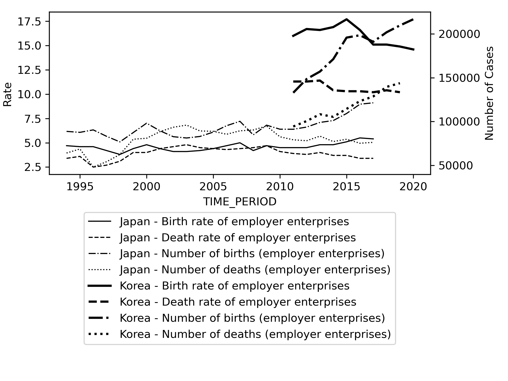

# business_survival
Python programs are to visualize business survival trends on birth and death rates and the number of births and that of deaths with OECD datasts and the official UK dataset.

jpkorea.py with jpkorea.csv is for Japan and Korea while ukge.py with ukge.csv is for the UK and Germany.

$ python jpkorea.py

$ python ukge.py

